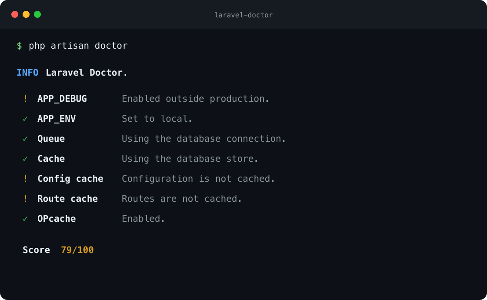

# Laravel Doctor

A small, zero-dependency health report for Laravel applications.



```text
Laravel Doctor

  ✓ APP_DEBUG    Disabled.
  ✓ APP_ENV      Set to production.
  ✓ Queue        Using the redis connection.
  ✓ Cache        Using the redis store.
  ✓ Config cache Configuration is cached.
  ! Route cache  Routes are not cached.
  ✓ OPcache      Enabled.

  Score  93/100
```

## Requirements

- PHP 8.2+
- Laravel 11, 12, or 13

## Installation

```bash
composer require flobbos/laravel-doctor --dev
```

Laravel discovers the service provider automatically. Run the report with:

```bash
php artisan doctor
```

Publish the configuration when you want to customize the checks:

```bash
php artisan vendor:publish --tag=doctor-config
```

## Custom checks

Implement `LaravelDoctor\Contracts\Check` and add the class to `config/doctor.php`:

```php
use LaravelDoctor\Contracts\Check;
use LaravelDoctor\ValueObjects\CheckResult;

final class DatabaseCheck implements Check
{
    public function run(): CheckResult
    {
        return CheckResult::pass('Database', 'Connection is healthy.');
    }
}
```

The container resolves every check, so constructor injection works as expected. Results can be `pass`, `warning`, or `fail`. Passes earn full score, warnings half score, and failures no score.

## Development

```bash
composer install
composer test
composer format
```

## License

MIT
